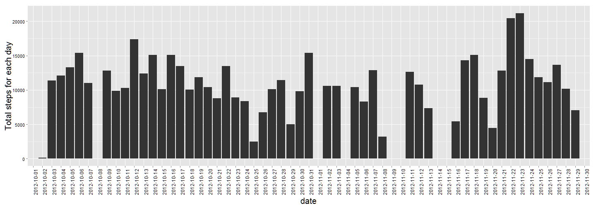
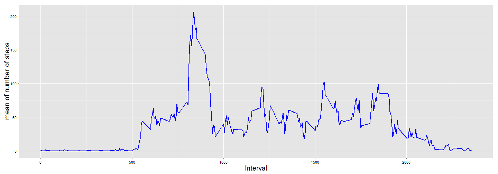
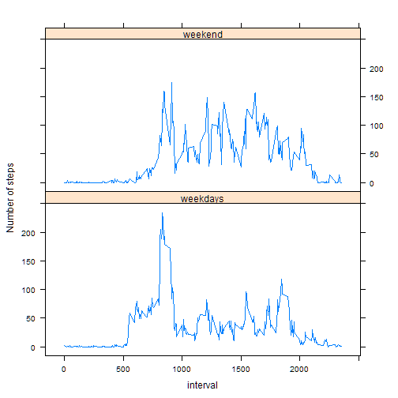

# Reproducible Research: Peer Assessment 1


## Loading and preprocessing the data

```r
data <- read.csv(unz("activity.zip","activity.csv"),stringsAsFactors = FALSE)
head(data)
```

```
##   steps       date interval
## 1    NA 2012-10-01        0
## 2    NA 2012-10-01        5
## 3    NA 2012-10-01       10
## 4    NA 2012-10-01       15
## 5    NA 2012-10-01       20
## 6    NA 2012-10-01       25
```

```r
str(data)
```

```
## 'data.frame':	17568 obs. of  3 variables:
##  $ steps   : int  NA NA NA NA NA NA NA NA NA NA ...
##  $ date    : chr  "2012-10-01" "2012-10-01" "2012-10-01" "2012-10-01" ...
##  $ interval: int  0 5 10 15 20 25 30 35 40 45 ...
```

## What is mean total number of steps taken per day?


```r
library(plyr)
```

```
## Warning: package 'plyr' was built under R version 3.0.3
```

```r
library(ggplot2)
```

```
## Warning: package 'ggplot2' was built under R version 3.0.3
```

###  Histogram of the total number of steps taken each day

```r
summarized_table <- ddply(data,.(date),
                          summarise,total_steps = sum(steps,na.rm = TRUE))

steps_hist <- ggplot(summarized_table,aes(x=date)) + 
        geom_histogram(aes(weights = total_steps)) + 
        ylab("Total steps for each day") +
        theme(axis.text.x = element_text(colour = "black",angle = 90,size = 12),
              axis.text.y = element_text(colour = "black",size = 11),
              axis.title = element_text(size = 20),
              plot.title = element_text(size = 30))
steps_hist 
```

 
###  Mean and median total number of steps taken per day

```r
step_mean <- mean(summarized_table$total_steps,na.rm = TRUE )
step_median <- median(summarized_table$total_steps,na.rm = TRUE)
```
- The mean of total number of steps is 9354.2295.

- The median of total number of steps is 10395. 


## What is the average daily activity pattern?


```r
inter_summar <- ddply(data, .(interval),summarise,mean = mean(steps,na.rm = TRUE))
pattern_plot <- ggplot(inter_summar,aes(interval,mean)) + 
        geom_line(size = 1,colour = "blue") +
        xlab("Interval") + 
        ylab("mean of number of steps")+
        theme(axis.text.x = element_text(colour = "black",size = 11),
              axis.text.y = element_text(colour = "black",size = 11),
              axis.title = element_text(size = 20),
              plot.title = element_text(size = 30))
pattern_plot 
```

 


```r
maxinter<- inter_summar$interval[which.max(inter_summar$mean)]
```
- The 835 contain the maximum number of steps.

## Imputing missing values
### Calculate and report the total number of missing values in the dataset (i.e. the total number of rows with NAs)

```r
num_missing <- sum(is.na(data$steps))
```
- The number of missing value is 2304.

### Devise a strategy for filling in all of the missing values in the dataset. 

- The strategy is fill the misssing data with the floored normal random number
with the mean and standard deviation each data


```r
## Calculate the mean and sd with each data
summarized_table2 <- ddply(data,.(date),
                          summarise,
                          mean_steps = mean(steps,na.rm = TRUE),
                          sd_steps = sd(steps,na.rm = TRUE))
rownames(summarized_table2) <- summarized_table2$date
```
### Create a new dataset that is equal to the original dataset but with the missing data filled in

```r
inputed <- data$steps 
names(inputed) <- data$date

## Using the normal random number with mean and sd to fill the missing data 
for( i in seq_along(inputed)){
        if(!is.na(inputed[i])) next
        else{   
                if(is.na(summarized_table2[names(inputed[i]),][,2])) inputed[i] <- 0
                else inputed[i] <- floor(rnorm(1,summarized_table2[names[inputed[1]],2],
                                               summarized_table2[names[inputed[1]],3]))                
        }
}

## Combine the inputed vector to new data frame
newData <- data.frame(steps = inputed, 
                      date = data$date,
                      interval = data$interval,
                      stringsAsFactors = TRUE)

head(newData)
```

```
##   steps       date interval
## 1     0 2012-10-01        0
## 2     0 2012-10-01        5
## 3     0 2012-10-01       10
## 4     0 2012-10-01       15
## 5     0 2012-10-01       20
## 6     0 2012-10-01       25
```

###  histogram of the total number of steps taken each day and Calculate and report the mean and median total number of steps taken per day

```r
summarized_tableN <- ddply(data,.(date),
                          summarise,total_steps = sum(steps),
                          mean_steps = mean(steps),
                          median_steps = median(steps))
head(summarized_tableN)
```

```
##         date total_steps mean_steps median_steps
## 1 2012-10-01          NA         NA           NA
## 2 2012-10-02         126     0.4375            0
## 3 2012-10-03       11352    39.4167            0
## 4 2012-10-04       12116    42.0694            0
## 5 2012-10-05       13294    46.1597            0
## 6 2012-10-06       15420    53.5417            0
```

```r
steps_histN <- ggplot(summarized_tableN,aes(x=date)) + 
        geom_histogram(aes(weights = total_steps)) + 
        ylab("Total steps for each day") +
        theme(axis.text.x = element_text(colour = "black",angle = 90,size = 12),
              axis.text.y = element_text(colour = "black",size = 11),
              axis.title = element_text(size = 20),
              plot.title = element_text(size = 30))
steps_histN
```

 


The inputation step did not affect the summarize so much, because the mean and sd for imputing the missing data are all come from the sample mean and  sd 

## Are there differences in activity patterns between weekdays and weekends?

```r
week <- weekdays(as.Date(data$date),abbreviate = TRUE) %in% c("Sun","Sat")
week <- as.factor(week)
levels(week) <- c("weekdays","weekend")
data$status <- week 
inter_summarW <- ddply(data, .(interval,status),summarise,mean = mean(steps,na.rm = TRUE))
```

```r
library(lattice)
```

```
## Warning: package 'lattice' was built under R version 3.0.3
```

```r
xyplot(mean~interval|status,
       data= inter_summarW,
       type = "l",layout = c(1,2),
       ylab = "Number of steps")
```

 
## Guid to reproduce the result 
* put the "activity.zip" under the working directory"
* open the script by R studio 
* clik knit HTML 
* packages required: ggplot2, lattice, plyr,
* section information as follows 

```r
sessionInfo()
```

```
## R version 3.0.2 (2013-09-25)
## Platform: x86_64-w64-mingw32/x64 (64-bit)
## 
## locale:
## [1] LC_COLLATE=English_Singapore.1252  LC_CTYPE=English_Singapore.1252   
## [3] LC_MONETARY=English_Singapore.1252 LC_NUMERIC=C                      
## [5] LC_TIME=English_Singapore.1252    
## 
## attached base packages:
## [1] stats     graphics  grDevices utils     datasets  methods   base     
## 
## other attached packages:
## [1] lattice_0.20-29 ggplot2_1.0.0   plyr_1.8.1      knitr_1.6      
## 
## loaded via a namespace (and not attached):
##  [1] colorspace_1.2-4 digest_0.6.4     evaluate_0.5.5   formatR_0.10    
##  [5] grid_3.0.2       gtable_0.1.2     labeling_0.2     MASS_7.3-33     
##  [9] munsell_0.4.2    proto_0.3-10     Rcpp_0.11.1      reshape2_1.4    
## [13] scales_0.2.4     stringr_0.6.2    tools_3.0.2
```
